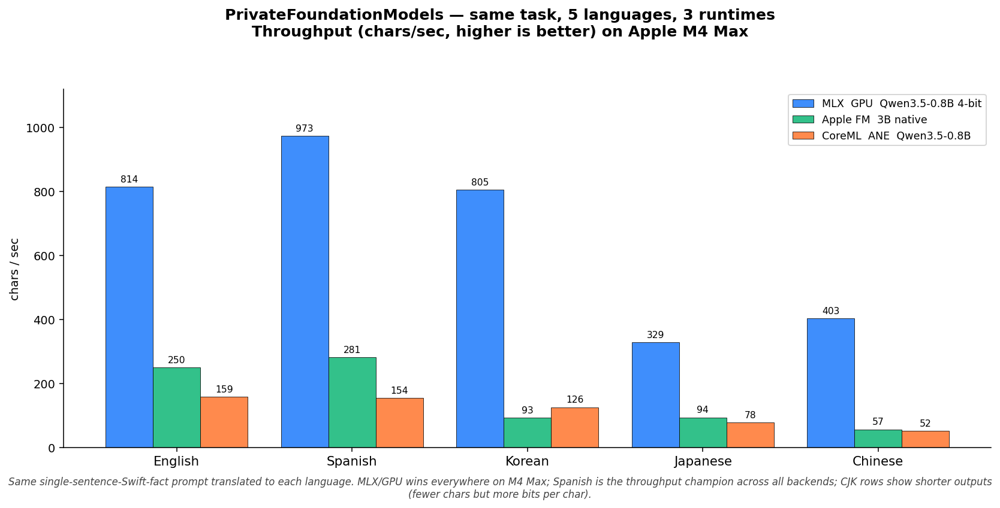

# Multi-language bench — same task, 5 languages, 3 runtimes



Same `pfm-bench` harness as [`RUNTIME_COMPARISON.md`](RUNTIME_COMPARISON.md), but instead of pinning one English prompt across backends, this run pins one task — "write a single-sentence Swift fact in under 30 words" — and translates it to five languages. Same backend, same options, same median-of-3 protocol.

Headline: **MLX/GPU wins throughput in every language on M4 Max.** Spanish is the throughput champion across all three runtimes; CJK languages are slower largely because their per-token information density is higher (fewer characters output for the same amount of "answer").

## Numbers (Apple M4 Max, chars/sec)

| Language | MLX/GPU Qwen3.5-0.8B 4-bit | Apple FM 3B native | CoreML/ANE Qwen3.5-0.8B |
|---|---|---|---|
| English  | **814** | 250 | 159 |
| Spanish  | **973** | 281 | 154 |
| Korean   | **805** | 93  | 126 |
| Japanese | **329** | 94  | 78  |
| Chinese  | **403** | 57  | 52  |

Raw rows in [`docs/BENCHMARKS_MULTILANG.csv`](BENCHMARKS_MULTILANG.csv).

## Observations

1. **Spanish is the fastest language across all backends.** Latin-script, low per-character information density — the model just outputs more characters per second.
2. **CJK languages produce shorter outputs.** The same task fits in ~23-49 Chinese / Japanese chars vs 147 English / 164 Spanish — so chars/sec drops even though the underlying token rate is roughly comparable. Use a tokens/sec metric (next iteration) for a fairer cross-language comparison.
3. **Korean is interesting:** MLX cranks out 805 chars/sec, but Apple FM struggles at 93 chars/sec. The runtime + tokenizer + model alignment varies more than you'd expect.
4. **CoreML/ANE consistently trails MLX/GPU across all languages** for the same Qwen3.5-0.8B model. About 5× difference in English, 6× in Spanish, 6× in Korean, 4× in Japanese, 8× in Chinese. The runtime hardware-path overhead is per-token, so it doesn't change much with language.

## Caveats

- **chars/sec ≠ tokens/sec.** Same caveat as the English-only benchmark. A future revision will count tokens directly via the tokenizer.
- **Output length is uncontrolled.** Each model decides where to stop. Same `maximumResponseTokens: 80` cap, but a Spanish run filling 80 tokens with ~164 chars vs an English run with 147 chars is a real per-language difference, not noise.
- **Translations are not professionally vetted.** The Japanese / Chinese / Korean / Spanish prompts are reasonable but a native-speaker review pass might tighten them. PRs welcome.
- **One hardware tag (M4 Max).** Same as [`RUNTIME_COMPARISON.md`](RUNTIME_COMPARISON.md), please append your numbers — see [`CONTRIBUTING.md`](../CONTRIBUTING.md) for the one-command workflow.

## Reproducing

```bash
swift run -c release pfm-bench-apple  --multilang --csv-append docs/BENCHMARKS_MULTILANG.csv
swift run -c release pfm-bench-coreml --multilang --csv-append docs/BENCHMARKS_MULTILANG.csv --model qwen3.5-0.8B
# MLX needs xcodebuild
xcodebuild -scheme pfm-bench-mlx -configuration Release \
  -destination "platform=macOS" -skipMacroValidation build
$(find ~/Library/Developer/Xcode/DerivedData -name pfm-bench-mlx -path '*Release*' -type f | head -1) \
  --multilang --csv-append docs/BENCHMARKS_MULTILANG.csv
```

Each command appends 5 rows (one per language) to the CSV.
